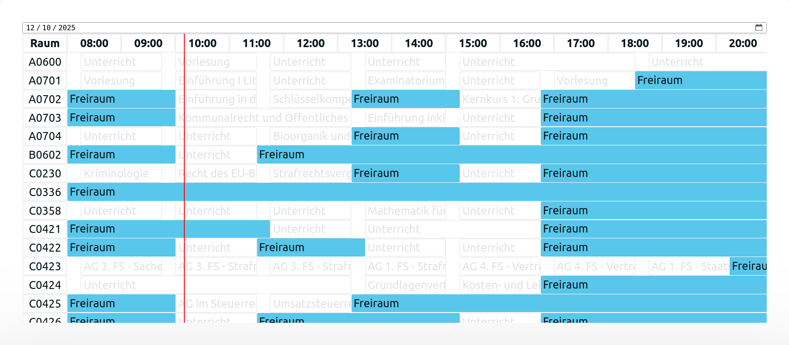

import UKNMap from '../../components/Freiraum/UKNMap.astro';

Freiraum is a room availability checker developed for the students of the University of Konstanz. Much like the [Frag Wahltraut tool](../frag-wahltraut), it runs entirely on the client side. Meaning, the server has no real knowledge of any rooms in the university or their status. Instead, the client code fetches the data from a server, that is only available from within the university network.

# Background
During the lecture and exam periods, students are in need of viable working areas. Both for silent and group work. While the library is readily available for silent work, even its vast space can at times (in exam periods) reach full capacity. On the front of working areas for groups, the library is short on rooms that are sound isolated.

Thankfully, the university itself is much more than its library. Many rooms, that are used throughout the day will occassionally have some free spots, in which students can freely occupy the space and even use it effectively for group work without disturbing others.

While the university has been working on accommodating the students' need for working spaces, a real long-term solution hasn't left the planning phase (atleast that I am aware of).

However, anyone within the university network has access to a certain web service, providing the full planned occupancy of many rooms within the university.

# The Idea
The current occupancy tool is very inaccessible:
- it's only reachable via an IP-address
- its UI is very dense and hard to navigate
- if you are searching for any vacancies on a given time and day, you're out of luck -- you have to go through each room by hand and check its availability at that time

While a replacement is on its way, the student representation decided to leverage the current endpoint and build a tool that:
- is easy to navigate
- and provides the students with exactly the information they need: 

<q>Which rooms are available throughout the day?</q>

# The Implementation
Freiraum mainly uses a timetable format with the rooms indicated by rows and the hours by columns. A vertical red indicator shows the current time over each row.

While lectures and other occupancies appear grayed-out, the computed free spots inbetween are rendered in a light blue shade, making current and future availabilities tangible at a single glance. 

Each room and event can be clicked for a more detailed overview.

## Room Details
- the **kind of room** (auditorium, seminar, etc.),
- **its building**
- **its designation**
- **its capacity**
- other details like the availability of a projector, HDMI or VGA connection, blackboard, etc. 

## Event Details
- the **kind of event** (lecture, seminar, etc.),
- **its title**,
- **the person that booked the slot**.

 

The entire HTML of the timetable is generated via client-side javascript, which leads to pretty involved code, but gets the job done.

# Future Work / Other Ideas
An initial proof of concept also included a map view intended to give a visual queue of where the room is located. I later dismissed the idea for the time being because obtaining the shape and geo data for each room would have entaled a lot of manual work.

However, I learned that germany, and in fact the european union as well, provides some basic geo data for buildings, their area and roof shape, which is how I extracted this wonderful geojson shape data for each of the university buildings:

<UKNMap />

If anyone feels like it, some kind of navigation system might be fun to implement. Though I have heard that many have tried and failed miserably already.

Sticking with the timetable view, there is still room for filters and search. Possible queries could restrict the displayed rooms to only those of a certain size or kind (who actually wants to study in an auditorium when there is no lecture there?). Even the availability of a projector or blackboard could be filtered for or made directly visible through the use of icons (while trying not to overload the initial overview of the rooms).

# Final Notes
Apart from that, I am content with Freiraum in its current form. Part of its charme for me is its simplicity, though I am certain some people would disaggree. The code base is fairly easy to maintain, despite it being written in vanilla javascript (I seem to have a knack for that -- call me a masochist I guess). Often times I can quickly swoop in and change aspects of the UI or logic, without having to search all too long. Granted, I wrote the hecking thing. But the generation code for the actual HTML timetable is the only aspect that feels convoluted to me. All things considered, I feel certain that anyone can pick the code and adapt it to their will. In terms of performance and reliablity it seems to be robust enough that nobody has thrown tomatoes in my face -- yet.

The actual data endpoint for the room occupancy will move to the university's e-learning platform soon. As of now I have no clue wether the new version on the e-learning platform will provide a similarly accessible view of vacant rooms for students (I highly doubt it). Nor do I know if there is a similar API endpoint, that Freiraum can be attached to; Unless the IT department of the university provides one themselves, Freiraum will probably not be able to exist in its current way.

Whatever the future may hold, I am happy to have seen that it found use both by students and university employees. It turns out that the simplest of tools can make quite a difference :)
